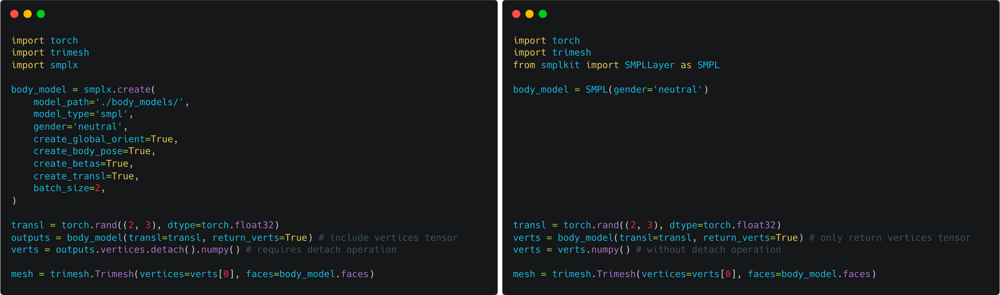

# smpl-kit

> `smplkit` is a versatile library that simplifies SMPL body model usage with automatic model path search, different body models support, adjustable batch size support, and useful utility functions for data processing and visualization.

<div align=center>

<i>The left figure utilizes smplx for creating an SMPL body mesh with random translation, while smplkit achieves the same functionality with a more concise code implementation.</i>
</div>

## Features

- [x] Automatic model path search in the workspace or home folder.
- [x] Support SMPL, SMPL+H, SMPL-X body models.
- [x] Support adjustable batch size of the SMPL parameters.
- [x] Provide numerous utility functions for SMPL parameters and meshes.
- [x] Provide visualization tools for viewing the results.

## Installation

1. Before installing `smplkit`, please make sure that you have installed [pytorch](https://pytorch.org/) and [pytorch3d](https://pytorch3d.org/).


2. To install the `smplkit` package, you can either install it from PyPI or install it from source.

   - To install from PyPI by using `pip`:

   ```bash
   pip install smplkit
   ```

   - Or, clone this repository and install it from source:

   ```bash
   git clone git@github.com:Silverster98/smpl-kit.git
   cd smpl-kit
   pip install .
   ```

## Documentation

### Tutorial

#### 0. Model path configuration

`smplkit` can search the model automatically. However, you can also specify the model path manually.

- If the `model_path` is not provided as a parameter for SMPL/SMPL+H/SMPL-X layers, the program will automatically search the models in current folder.
  - If `./body_models/` exists, the program will search the models in `./body_models/`.
    - You should organize the `./body_models/` as follows:
        ```bash
        |- ./body_models/
        |--- smpl/  # SMPL model
        |----- SMPL_NEUTRAL.pkl
        |--- smplh/ # SMPL+H model
        |----- SMPLH_NEUTRAL.pkl
        |----- SMPLH_MALE.pkl
        |----- SMPLH_FEMALE.pkl
        |--- smplx/ # SMPL-X model
        |----- SMPLX_NEUTRAL.npz
        |----- SMPLX_MALE.npz
        |----- SMPLX_FEMALE.npz
        ```
  - If `./body_models` does not exist, the program will search the models in `~/.body_models/`, i.e., the home folder.
    - You should organize the `~/.body_models/` as follows (similar to the above):
        ```bash
        |- ~/.body_models/
        |--- smpl/  # SMPL model
        |--- smplh/ # SMPL+H model
        |--- smplx/ # SMPL-X model
        ```
  - So, you can either put the models in one workspace for one project or in the home folder for all related projects.
- If the `model_path` is provided as a parameter for SMPL/SMPL+H/SMPL-X layers, the program will search the models in the given path.
  - If the `model_path` is file path, the program will load the model from the given file path.
  - If the `model_path` if folder path, the program will search the models in the given folder path.
    - You should organize the given folder as follows (similar to the above):
        ```bash
        |- ${GIVEN_FOLDER}/
        |--- smpl/  # SMPL model
        |--- smplh/ # SMPL+H model
        |--- smplx/ # SMPL-X model
        ```

#### 1. Use the `SMPLLayer` to generate a SMPL body mesh with random translation while keeping other parameters as zero:

```python
import torch
import trimesh
from smplkit import SMPLLayer as SMPL

body_model = SMPL()

transl = torch.rand((2, 3), dtype=torch.float32)
verts = body_model(transl=transl, return_verts=True)
verts = verts.numpy()

mesh = trimesh.Trimesh(vertices=verts[0], faces=body_model.faces)
```

#### 2. Use the `SMPLParam` to optimize the SMPL parameters (**only tranlation**) with a given mesh:

```python
import torch
from smplkit import SMPLLayer as SMPL
from smplkit import SMPLParam
from torch.optim import SGD

bm = SMPL(num_betas=10)

target_transl = torch.tensor([[0, 1, 0]], dtype=torch.float32)
target_verts = bm(transl=target_transl, return_verts=True)

## init param and optimizer
param = SMPLParam(transl=torch.rand(1, 3), requires_grad=[True, False, False, False])
opt = SGD(param.trainable_parameters(), lr=0.1)

for i in range(200):
    opt.zero_grad()
    output = bm(**param._parameters_dict(), return_verts=True)
    
    loss = ((output - target_verts) ** 2).mean()
    
    loss.backward()
    opt.step()

    if (i + 1) % 20 == 0:
        print(f"Optimization Error in Step {i + 1:3d}: {loss.item()}")
```

### API

- [x] SMPLLayer
- [x] SMPLHLayer
- [x] SMPLXLayer
- [x] SMPLParam
- [x] SMPLHParam
- [x] SMPLXParam
- [x] utils
  - [x] matrix_to_parameter
  - [ ] compute_orient
  - [ ] compute_normal
  - [ ] compute_sdf
  - [x] VertexSelector
    - select_vertex
    - contact_vertex (Only support SMPL-X now)
    - key_vertex
  - [x] JointSelector
    - select_joint
  - [x] BodyModel
    - reset
    - run
    - to
- [ ] visualize
- [x] constants
  - [x] VERTEX_NUM
  - [x] JOINTS_NUM
  - [x] KEY_VERTEX_IDS
  - [x] CONTACT_PART_NAME
  - [x] CONTACT_VERTEX_IDS (Only support SMPL-X now)
  - [x] JOINTS_NAME
  - [x] SMPLX_LANDMARKS_NAME
  - [x] SKELETON_CHAIN
  - [x] SKELETON_PARENTS

## License

This project is licensed under the terms of the [MIT](LICENSE) license.

## Acknowledgement

Some codes are borrowed from [SMPL-X](https://github.com/vchoutas/smplx). If your use this code, please consider citing the most relevant [works](https://github.com/vchoutas/smplx#citation).
